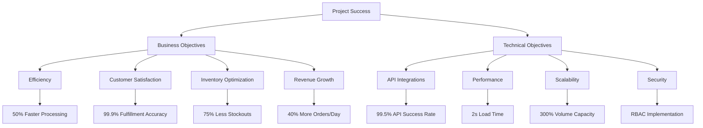
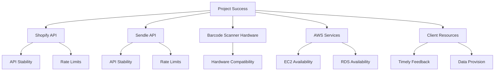
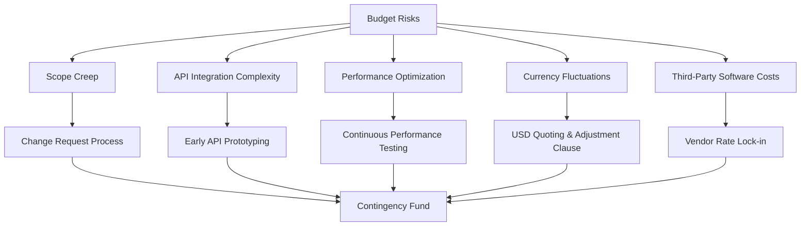
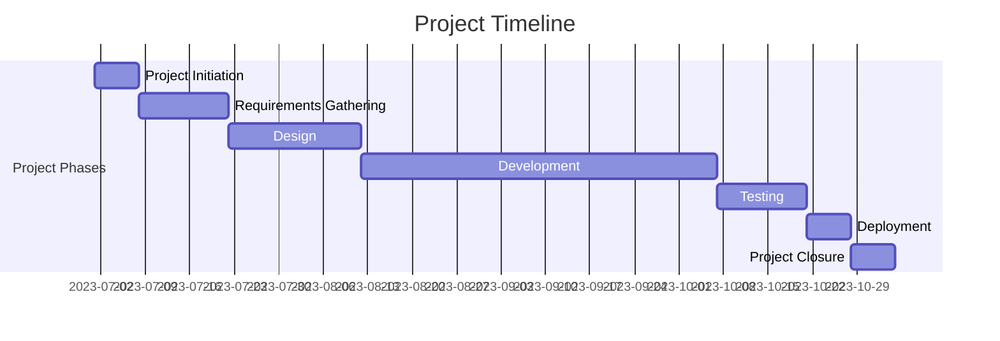
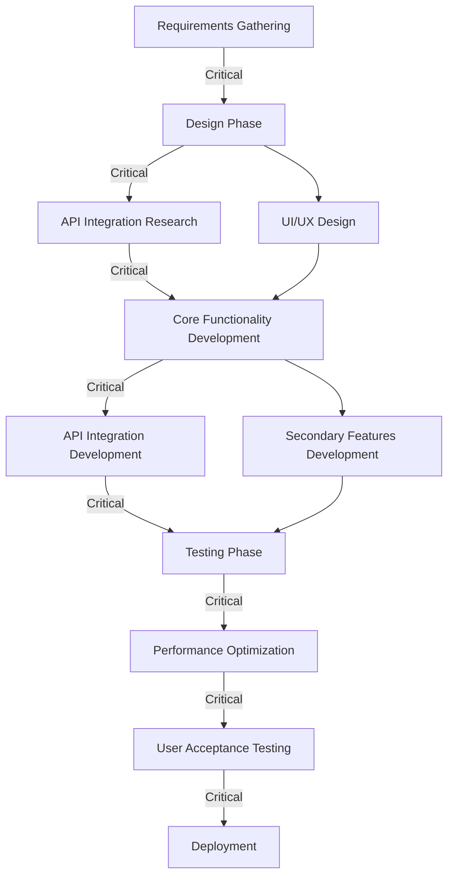
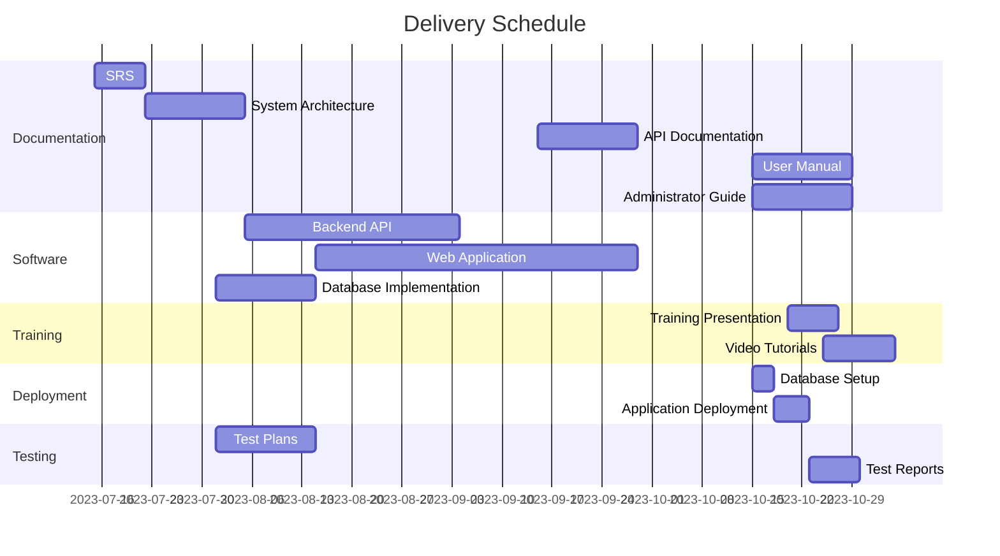

## EXECUTIVE SUMMARY

### PROJECT OVERVIEW

This project aims to develop a comprehensive web-based Inventory Management and Fulfillment Application for an e-commerce store operating on Shopify. The client faces challenges in efficiently managing inventory and streamlining the order fulfillment process. Our proposed solution addresses these issues by creating a seamless integration between the client's Shopify store, inventory management system, and shipping processes.

The application will:
- Automatically pull and categorize unfulfilled orders from Shopify
- Determine order fulfillment feasibility based on real-time inventory levels
- Facilitate order processing through barcode scanning and automated shipping label generation
- Provide robust inventory management tools
- Synchronize data with Shopify to ensure accuracy across platforms

### OBJECTIVES

| Objective | Description | Benefit to Client |
|-----------|-------------|-------------------|
| Streamline Order Management | Automate sorting of unfulfilled orders based on inventory availability | Reduced processing time and improved efficiency |
| Enhance Fulfillment Process | Implement barcode scanning and automated shipping label generation | Minimized errors and faster order processing |
| Improve Inventory Control | Provide tools for easy inventory updates and real-time tracking | Better stock management and reduced stockouts |
| Integrate Systems | Seamlessly connect with Shopify and Sendle APIs | Unified workflow and reduced manual data entry |
| Optimize User Experience | Deliver an intuitive web application interface | Increased productivity and reduced training time |

### VALUE PROPOSITION

Our agency offers a unique combination of expertise and tailored solutions that set us apart for this project:

1. **E-commerce Integration Specialists**: Our team has extensive experience in developing solutions that integrate seamlessly with Shopify and other e-commerce platforms.

2. **Custom-Built Solution**: Unlike off-the-shelf products, our application will be tailored specifically to the client's workflow and requirements, ensuring maximum efficiency and usability.

3. **Scalable Architecture**: We design our solutions with growth in mind, allowing the system to easily accommodate increasing order volumes and inventory complexity.

4. **User-Centric Design**: Our focus on creating intuitive interfaces will minimize the learning curve and maximize adoption among staff.

5. **Ongoing Support and Maintenance**: We offer comprehensive post-launch support to ensure the system continues to meet the client's evolving needs.

6. **Data-Driven Insights**: Our solution will provide valuable analytics and reporting features, enabling the client to make informed decisions about inventory and fulfillment strategies.

By choosing our agency, the client will receive a robust, scalable, and user-friendly solution that not only addresses their current challenges but also positions them for future growth and success in the competitive e-commerce landscape.

## PROJECT OBJECTIVES

### BUSINESS GOALS

1. Increase Operational Efficiency
   - Reduce order processing time by 50%
   - Decrease inventory discrepancies by 80%
   - Minimize manual data entry errors by 95%

2. Enhance Customer Satisfaction
   - Improve order fulfillment accuracy to 99.9%
   - Reduce shipping delays by 70%
   - Decrease customer inquiries about order status by 60%

3. Optimize Inventory Management
   - Reduce stockouts by 75%
   - Decrease overstocking instances by 50%
   - Improve inventory turnover ratio by 30%

4. Boost Revenue
   - Increase the number of fulfilled orders per day by 40%
   - Reduce lost sales due to stockouts by 80%

5. Streamline Workforce Management
   - Reduce staff overtime hours related to order fulfillment by 60%
   - Increase employee productivity in the fulfillment process by 35%

### TECHNICAL GOALS

1. Shopify Integration
   - Implement real-time synchronization of orders and inventory data
   - Achieve 99.9% uptime for the Shopify API connection

2. Sendle API Integration
   - Automate shipping label generation for 100% of eligible orders
   - Ensure 99.5% successful API calls for label creation

3. Barcode Scanning System
   - Implement a robust barcode scanning system compatible with industry-standard hardware
   - Achieve a 99.9% accuracy rate for barcode scans

4. Database Performance
   - Optimize database queries to handle up to 10,000 SKUs with sub-second response times
   - Implement efficient indexing and caching strategies for inventory data

5. User Interface
   - Develop a responsive web application that loads within 2 seconds on standard broadband connections
   - Ensure the UI is intuitive enough to reduce training time for new staff by 50%

6. System Scalability
   - Design the architecture to handle a 300% increase in order volume without performance degradation
   - Implement horizontal scaling capabilities for future growth

7. Security Implementation
   - Implement end-to-end encryption for all data transmissions
   - Establish role-based access control (RBAC) for different user types

### SUCCESS CRITERIA

| Criterion | Target | Measurement Method |
|-----------|--------|---------------------|
| Order Processing Time | 50% reduction | Compare average time to process an order before and after system implementation |
| Inventory Accuracy | 99% | Monthly inventory audits comparing physical count to system records |
| Order Fulfillment Accuracy | 99.9% | Track incorrect shipments as a percentage of total orders fulfilled |
| System Uptime | 99.9% | Monitoring logs and downtime reports |
| User Adoption Rate | 95% | Percentage of staff actively using the system after 1 month of implementation |
| API Integration Success Rate | 99.5% | Monitor and log successful API calls vs. total attempts |
| Load Time Performance | < 2 seconds | Automated performance testing tools measuring page load times |
| Barcode Scanning Accuracy | 99.9% | Error logs from scanning process and manual audits |
| Customer Satisfaction | 30% increase | Compare customer satisfaction surveys before and after implementation |
| Revenue Impact | 15% increase | Compare monthly revenue figures pre and post-implementation |

This success criteria diagram illustrates the hierarchical relationship between the project's overall success, its main objectives (both business and technical), and specific, measurable targets for each objective. This visual representation helps stakeholders quickly grasp the key metrics that will define the project's success.

## SCOPE OF WORK

### IN-SCOPE

The following tasks, features, and functionalities are included in the project:

1. User Authentication and Authorization
   - Secure login system for authorized personnel
   - Role-based access control (admin, warehouse staff)

2. Dashboard
   - Summary metrics display (unfulfilled orders, fulfillable orders, inventory levels)

3. Order Management
   - Unfulfilled Orders Tab
   - Orders That Can Be Fulfilled Tab
   - Orders That Cannot Be Fulfilled Tab
   - Order processing logic implementation

4. Order Fulfillment Process
   - Fulfillment modal with barcode scanning functionality
   - Integration with Sendle API for shipping label generation
   - Shopify order status update via API
   - Inventory adjustment upon fulfillment

5. Inventory Management
   - Inventory intake through barcode scanning and manual entry
   - Inventory overview with filtering and searching capabilities
   - Bulk addition support for multiple SKUs

6. Error Handling
   - User notifications for scanning, fulfillment, and inventory update issues
   - System logging for debugging purposes
   - Retry mechanisms for transient errors

7. API Integrations
   - Shopify API integration for order retrieval and updates
   - Sendle API integration for shipping label creation

8. User Interface
   - Responsive web application design optimized for desktop browsers
   - Intuitive layout with consistent design across all pages

9. Inventory Adjustment Rules
   - Automated inventory count updates for receiving and fulfilling orders
   - Discrepancy reporting and alerts

10. SKU Management
    - Unique identification system for each SKU/barcode
    - Product attribute management (size, color, name)

11. Barcode Scanning
    - Compatibility with commonly used barcode scanners
    - Validation of scanned items against order details

12. Shipping Label Workflow
    - Immediate label display after creation
    - Options for printing or downloading labels

13. Testing
    - Unit tests for critical components
    - Integration tests for system components

14. Documentation
    - User manuals
    - Technical documentation for maintenance

### OUT-OF-SCOPE

The following items are explicitly excluded from the project scope:

1. Mobile application development
2. Integration with multiple Shopify stores
3. Custom hardware procurement or setup
4. Physical inventory auditing processes
5. Customer-facing features or interfaces
6. Integration with accounting or ERP systems
7. Advanced analytics or business intelligence features
8. Multi-language support
9. Offline mode functionality
10. Integration with shipping carriers other than Sendle

### ASSUMPTIONS

The project plan is based on the following assumptions:

1. The client has an active Shopify store with API access.
2. The client has an account with Sendle and can provide necessary API credentials.
3. The client will provide timely feedback during development iterations.
4. The client's staff has basic computer literacy and can be trained on the new system.
5. The client has compatible barcode scanning hardware or is willing to procure it.
6. The client's internet connectivity is stable and sufficient for cloud-based operations.
7. The client's inventory data is accurate at the start of the project.
8. The client will provide sample data for testing purposes.
9. The client's Shopify plan supports the required API functionalities.
10. The project team will have access to necessary development and testing environments.

### DEPENDENCIES

The following dependencies could impact the project timeline or deliverables:

1. Shopify API:
   - Stability and uptime of the Shopify API
   - Any changes or deprecations in the API during development
   - API rate limits that may affect data synchronization

2. Sendle API:
   - Availability and reliability of the Sendle API
   - Any changes in the API structure or authentication methods
   - Rate limits or usage restrictions

3. Barcode Scanner Hardware:
   - Compatibility of the client's existing or new barcode scanners with the system
   - Delivery timelines if new hardware needs to be procured

4. AWS Services:
   - Availability and performance of AWS EC2 and RDS services
   - Any scheduled maintenance or updates to AWS services

5. Client Resources:
   - Availability of client personnel for providing information, feedback, and testing
   - Timely provision of necessary data, credentials, and access to systems

6. Third-Party Libraries and Frameworks:
   - Compatibility of chosen libraries and frameworks with project requirements
   - Any critical updates or security patches released during development

7. Browser Compatibility:
   - Ensuring the web application functions correctly across specified desktop browsers

8. Data Migration:
   - Accuracy and completeness of existing inventory data
   - Time required for data cleaning and migration

9. Legal and Compliance:
   - Any regulatory requirements for data handling and storage
   - Compliance with Shopify and Sendle terms of service

10. Training and Adoption:
    - Availability of client staff for training sessions
    - User adoption rate, which may affect the final acceptance of the system

## BUDGET AND COST ESTIMATES

### COST BREAKDOWN

The following table provides a detailed breakdown of the project costs:

| Category | Item | Quantity | Unit Cost | Total Cost |
|----------|------|----------|-----------|------------|
| Labor | Senior Developer | 480 hours | $100/hour | $48,000 |
| Labor | Junior Developer | 640 hours | $60/hour | $38,400 |
| Labor | UI/UX Designer | 160 hours | $80/hour | $12,800 |
| Labor | Project Manager | 240 hours | $90/hour | $21,600 |
| Labor | QA Tester | 160 hours | $70/hour | $11,200 |
| Software | Development Tools Licenses | 5 | $500/license | $2,500 |
| Infrastructure | AWS EC2 Instance (1 year) | 1 | $2,000/year | $2,000 |
| Infrastructure | AWS RDS Instance (1 year) | 1 | $1,500/year | $1,500 |
| Miscellaneous | Contingency Fund | 1 | $10,000 | $10,000 |
| **Total** | | | | **$148,000** |

### PAYMENT SCHEDULE

The proposed payment schedule is tied to project milestones and deliverables:

| Milestone | Deliverable | Payment Percentage | Amount |
|-----------|-------------|---------------------|--------|
| Project Kickoff | Signed contract and initial planning documents | 20% | $29,600 |
| Design Approval | Approved UI/UX designs and technical architecture | 20% | $29,600 |
| Development Phase 1 | Completed core functionality (order management, inventory management) | 25% | $37,000 |
| Development Phase 2 | Completed API integrations (Shopify, Sendle) | 20% | $29,600 |
| User Acceptance Testing | Successful completion of UAT and bug fixes | 10% | $14,800 |
| Project Completion | Final deployment and handover of documentation | 5% | $7,400 |
| **Total** | | **100%** | **$148,000** |

### BUDGET CONSIDERATIONS

Several factors could potentially impact the budget. We have identified these risks and proposed mitigation strategies:

1. **Scope Creep**
   - Risk: Additional features or changes requested during development.
   - Mitigation: Clearly defined scope in the contract, change request process with associated costs.

2. **API Integration Complexity**
   - Risk: Unforeseen challenges in integrating with Shopify or Sendle APIs.
   - Mitigation: Allocated additional hours in the estimate for integration work, early prototyping of API interactions.

3. **Performance Optimization**
   - Risk: Additional time required to meet performance requirements for large inventories.
   - Mitigation: Performance testing throughout development, scalable architecture design from the start.

4. **Currency Fluctuations**
   - Risk: If the project spans multiple months, currency exchange rates could affect costs.
   - Mitigation: All costs are quoted in USD, with a clause for rate adjustment if fluctuation exceeds 5%.

5. **Third-Party Software Costs**
   - Risk: Potential increase in licensing costs for development tools or services.
   - Mitigation: Locked-in rates with vendors where possible, contingency fund to cover potential increases.

The contingency fund of $10,000 has been included in the budget to address these potential risks. Any unused portion of this fund will be returned to the client at the project's conclusion. Regular budget reviews will be conducted throughout the project lifecycle to ensure costs remain within the agreed-upon limits.

## TIMELINE AND MILESTONES

### PROJECT TIMELINE

The project is estimated to take 16 weeks (4 months) from initiation to completion. Here's a high-level timeline outlining the major phases:

### KEY MILESTONES

| Milestone | Description | Estimated Date |
|-----------|-------------|----------------|
| M1: Project Kickoff | Project initiation and team onboarding complete | Week 1 |
| M2: Requirements Sign-off | Detailed requirements document approved by stakeholders | Week 3 |
| M3: Design Approval | UI/UX designs and technical architecture approved | Week 6 |
| M4: Development Sprint 1 Complete | Core functionality (order management, inventory management) implemented | Week 10 |
| M5: Development Sprint 2 Complete | API integrations (Shopify, Sendle) implemented | Week 14 |
| M6: Testing Complete | All testing phases finished, including UAT | Week 15 |
| M7: Go-Live | Application deployed to production environment | Week 16 |
| M8: Project Closure | Final documentation delivered, project retrospective conducted | Week 16 |

### CRITICAL PATH

The following tasks and activities are critical to keeping the project on schedule:

1. **Requirements Gathering and Sign-off**
   - Delay in finalizing requirements will impact all subsequent phases
   - Ensure active stakeholder participation and timely feedback

2. **API Integration Research and Development**
   - Early prototyping of Shopify and Sendle API integrations
   - Any issues with API compatibility or limitations must be identified and resolved quickly

3. **Core Functionality Development**
   - Order management and inventory management systems are foundational
   - Delays in these components will impact overall project timeline

4. **User Acceptance Testing (UAT)**
   - Timely completion of UAT is crucial for identifying any last-minute issues
   - Ensure client availability for UAT participation

5. **Performance Optimization**
   - System must handle specified load and response times
   - Any performance issues identified late in development could require significant rework

To maintain the project schedule:

1. Conduct daily stand-ups to quickly identify and address any blockers
2. Implement weekly progress reviews to ensure alignment with the timeline
3. Maintain open communication channels with the client for quick decision-making
4. Use agile methodologies to adapt to changes without derailing the overall timeline
5. Allocate buffer time in each phase to account for unforeseen challenges

By focusing on these critical path elements and maintaining flexibility in our approach, we aim to deliver the project on time and to the highest quality standards.

## DELIVERABLES

### LIST OF DELIVERABLES

The following table provides a comprehensive list of all tangible outputs that will be delivered as part of this project:

| Category | Deliverable | Description |
|----------|-------------|-------------|
| Software Components | Web Application | Fully functional web-based Inventory Management and Fulfillment Application |
| Software Components | Backend API | RESTful API to handle data processing and integrations |
| Software Components | Database | Implemented PostgreSQL database with all necessary tables and relationships |
| Documentation | Software Requirements Specification (SRS) | Detailed document outlining all functional and non-functional requirements |
| Documentation | System Architecture Document | Technical document describing the overall system design and component interactions |
| Documentation | API Documentation | Comprehensive guide for all API endpoints, request/response formats, and usage examples |
| Documentation | User Manual | Step-by-step guide for end-users on how to use the application |
| Documentation | Administrator Guide | Detailed instructions for system administrators on configuration, maintenance, and troubleshooting |
| Training Materials | User Training Presentation | PowerPoint slides covering all aspects of using the application |
| Training Materials | Video Tutorials | Set of screen-captured videos demonstrating key features and workflows |
| Deployment | Deployed Application | Fully configured and deployed application on AWS EC2 instances |
| Deployment | Database Setup | Configured and populated PostgreSQL database on AWS RDS |
| Testing | Test Plans | Comprehensive test plans covering unit, integration, and user acceptance testing |
| Testing | Test Reports | Detailed reports of all test results, including any issues found and resolutions |

### DELIVERY SCHEDULE

The following Mermaid.js Gantt chart illustrates the delivery schedule for each deliverable:

### ACCEPTANCE CRITERIA

The following table outlines the acceptance criteria for each major deliverable:

| Deliverable | Acceptance Criteria |
|-------------|---------------------|
| Web Application | - All features specified in the SRS are implemented and functional - Application passes all user acceptance tests - Responsive design works on specified desktop browsers - Performance meets or exceeds specified requirements (e.g., page load times) |
| Backend API | - All endpoints are implemented and return correct responses - API passes all integration tests - Handles error scenarios gracefully - Meets specified performance requirements (e.g., response times) |
| Database | - All required tables and relationships are correctly implemented - Data integrity constraints are in place - Performs efficiently with test data set |
| Documentation | - All documents are complete, accurate, and up-to-date - Documents are clear, well-structured, and free of grammatical errors - Technical accuracy verified by development team |
| Training Materials | - Cover all key features and workflows of the application - Clear and easy to understand for the target audience - Consistent with the final delivered application |
| Deployed Application | - Application is accessible via specified URL - All features work as expected in the production environment - Meets specified security requirements - Integrates correctly with Shopify and Sendle APIs |
| Test Reports | - Cover all planned test cases - Clearly document any issues found and their resolutions - Signed off by QA lead and project manager |

Each deliverable will be reviewed by the client upon completion. The client will have a 5-business-day review period to accept the deliverable or provide feedback for necessary adjustments. Final acceptance of all deliverables is required for project completion.