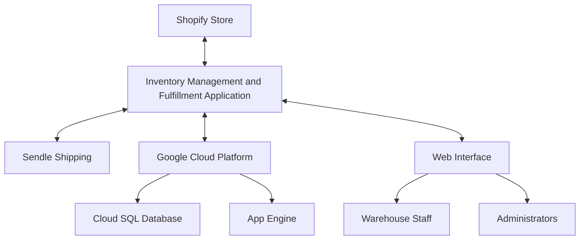
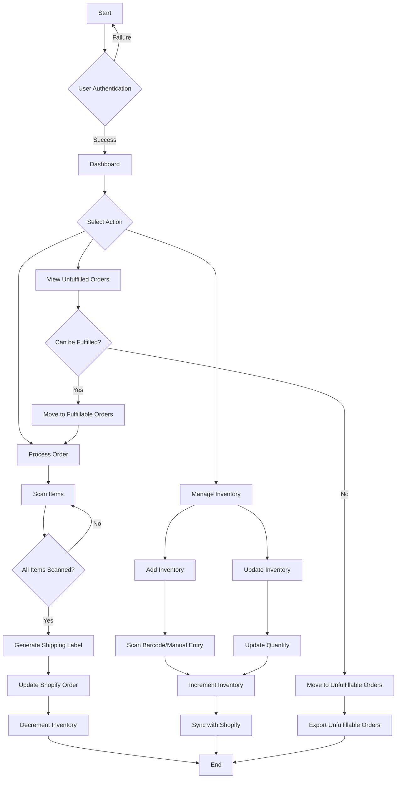
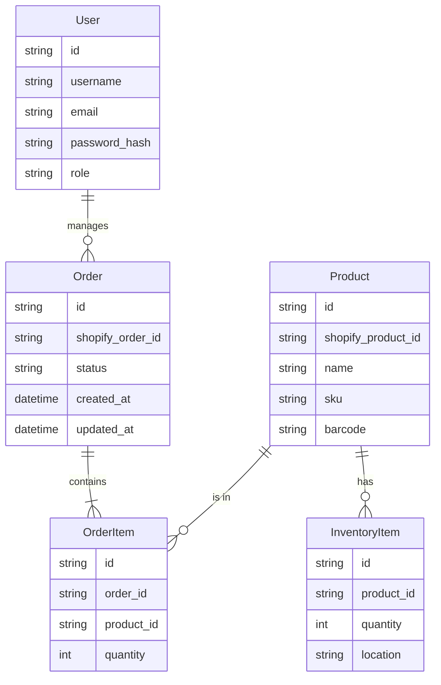
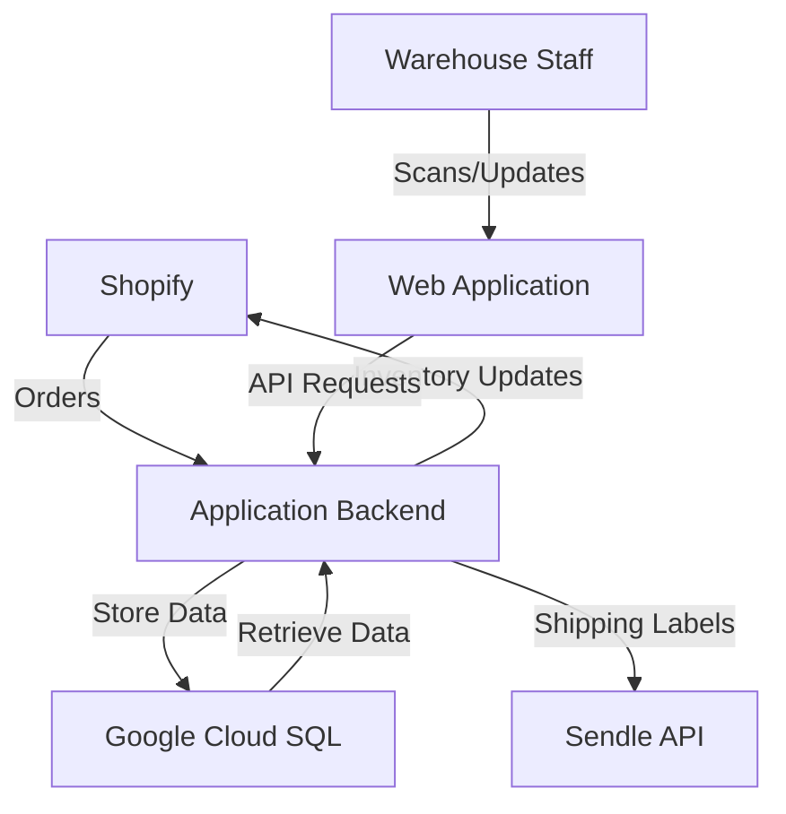

# 1. INTRODUCTION

## 1.1 PURPOSE

The purpose of this Software Requirements Specification (SRS) document is to provide a comprehensive description of the Inventory Management and Fulfillment Application for an e-commerce store operating on Shopify. This document outlines the functional and non-functional requirements, system architecture, and technical specifications necessary for the development team to implement the solution.

This SRS is intended for the following audience:

1. Development Team: To guide the implementation of the software system.
2. Project Managers: To plan and oversee the development process.
3. Quality Assurance Team: To develop test plans and ensure the software meets specified requirements.
4. Client Stakeholders: To review and approve the proposed solution.
5. Maintenance and Support Team: To understand the system for future updates and troubleshooting.

## 1.2 SCOPE

The Inventory Management and Fulfillment Application is a web-based solution designed to streamline and automate the order fulfillment process for e-commerce businesses using Shopify. The system will integrate with Shopify's API to manage orders and inventory, and with Sendle's API for shipping label generation.

### Goals:

1. Automate the process of sorting and fulfilling orders based on inventory availability.
2. Provide real-time inventory management capabilities.
3. Streamline the order fulfillment process through barcode scanning and automated shipping label generation.
4. Maintain accurate synchronization between the application, Shopify, and inventory levels.

### Benefits:

1. Increased operational efficiency in order processing and fulfillment.
2. Reduced errors in inventory management and order fulfillment.
3. Improved customer satisfaction through faster and more accurate order processing.
4. Enhanced visibility into inventory levels and order statuses.
5. Reduced manual workload for staff, allowing focus on higher-value tasks.

### Core Functionalities:

1. User Authentication and Authorization
   - Secure login system with role-based access control

2. Order Management
   - Automatic retrieval of unfulfilled orders from Shopify
   - Categorization of orders based on fulfillment possibility
   - Order processing workflow with barcode scanning

3. Inventory Management
   - Real-time inventory tracking
   - Barcode-based and manual inventory updates
   - Low stock alerts and reporting

4. Fulfillment Process
   - Guided fulfillment workflow with barcode validation
   - Automated shipping label generation via Sendle API
   - Order status updates in Shopify

5. Reporting and Analytics
   - Inventory level reports
   - Order fulfillment performance metrics
   - Export functionality for unfulfillable orders

6. Integration
   - Seamless integration with Shopify API for order and inventory synchronization
   - Integration with Sendle API for shipping label generation

The application will be developed using TypeScript and React for the frontend, with Tailwind CSS for styling. The backend will be implemented in Python, leveraging the Google Cloud ecosystem for hosting and services where applicable. This tech stack ensures a modern, scalable, and maintainable solution that aligns with the client's requirements and industry best practices.

# 2. PRODUCT DESCRIPTION

## 2.1 PRODUCT PERSPECTIVE

The Inventory Management and Fulfillment Application is a web-based solution designed to integrate seamlessly with an existing e-commerce ecosystem. It serves as a critical bridge between the client's Shopify store, inventory management processes, and shipping operations. The application operates within the following context:

1. Shopify Integration: The system interfaces directly with the client's Shopify store, pulling unfulfilled orders and updating order statuses and inventory levels in real-time.

2. Sendle Integration: The application connects with Sendle's API to generate shipping labels, streamlining the fulfillment process.

3. Inventory Management: It acts as the central hub for inventory tracking, providing real-time visibility into stock levels and facilitating both automated and manual updates.

4. User Interface: The web application serves as the primary interface for warehouse staff and administrators to manage orders, inventory, and fulfillment processes.

5. Data Storage: The system utilizes a cloud-based database to store and manage inventory data, order information, and user data.

6. Hosting Environment: The application is hosted on Google Cloud Platform, leveraging its scalability and reliability for optimal performance.

## 2.2 PRODUCT FUNCTIONS

The Inventory Management and Fulfillment Application will perform the following main functions:

1. Order Management:
   - Automatically retrieve unfulfilled orders from Shopify
   - Categorize orders based on fulfillment possibility
   - Display orders in a user-friendly interface

2. Inventory Tracking:
   - Maintain real-time inventory levels
   - Support barcode scanning for inventory updates
   - Provide low stock alerts and reporting

3. Order Fulfillment:
   - Guide users through the fulfillment process with barcode validation
   - Generate shipping labels via Sendle API integration
   - Update order status in Shopify upon fulfillment

4. User Authentication and Authorization:
   - Secure login system with role-based access control
   - Manage user permissions for different functionalities

5. Reporting and Analytics:
   - Generate inventory level reports
   - Provide order fulfillment performance metrics
   - Export unfulfillable orders data

6. Integration Management:
   - Maintain seamless communication with Shopify API
   - Handle Sendle API interactions for shipping label generation
   - Manage error handling and retry mechanisms for API calls

7. Data Synchronization:
   - Ensure consistent data between the application, Shopify, and inventory records
   - Handle conflict resolution in case of data discrepancies

## 2.3 USER CHARACTERISTICS

The application is designed to cater to two primary user groups:

1. Warehouse Staff:
   - Expertise Level: Basic to intermediate computer skills
   - Responsibilities: Day-to-day order processing, inventory management, and fulfillment tasks
   - Key Needs: Intuitive interface, clear workflow guidance, efficient barcode scanning process

   Persona: Alex, Warehouse Associate
   - Age: 28
   - Experience: 3 years in e-commerce fulfillment
   - Tech Savvy: Moderate
   - Goals: Process orders quickly and accurately, maintain organized inventory

2. Administrators:
   - Expertise Level: Advanced computer skills, understanding of e-commerce operations
   - Responsibilities: System configuration, user management, performance monitoring, and reporting
   - Key Needs: Comprehensive dashboard, detailed reporting capabilities, user management tools

   Persona: Sam, E-commerce Operations Manager
   - Age: 35
   - Experience: 7 years in e-commerce management
   - Tech Savvy: High
   - Goals: Optimize fulfillment processes, maintain accurate inventory, generate insights for business decisions

Both user groups require a responsive, reliable, and user-friendly interface that minimizes training time and maximizes productivity.

## 2.4 CONSTRAINTS

The development and implementation of the Inventory Management and Fulfillment Application are subject to the following constraints:

1. Technical Constraints:
   - Must be compatible with the latest stable versions of Chrome, Firefox, and Safari desktop browsers
   - Backend must be developed in Python to align with the existing tech stack
   - Frontend must utilize TypeScript, React, and Tailwind CSS for consistency and maintainability
   - Must integrate with Shopify API version 2023-04 or later
   - Must be hosted on Google Cloud Platform

2. Regulatory Constraints:
   - Must comply with data protection regulations (e.g., GDPR, CCPA) for handling customer information
   - Must adhere to PCI DSS standards for processing and storing any payment-related data

3. Operational Constraints:
   - Must support a minimum of 10,000 SKUs without performance degradation
   - Must handle up to 1,000 orders per day during peak periods
   - System response time must not exceed 2 seconds for any operation under normal load

4. Budgetary Constraints:
   - Development and first-year operational costs must not exceed the allocated budget of $148,000
   - Ongoing maintenance and hosting costs must be optimized for cost-effectiveness

5. Time Constraints:
   - The application must be fully developed, tested, and deployed within the 16-week project timeline
   - User training and documentation must be completed within this timeframe

6. Integration Constraints:
   - Must operate within the rate limits imposed by Shopify and Sendle APIs
   - Must adapt to any changes or deprecations in the integrated APIs during the development lifecycle

7. User Interface Constraints:
   - Must be accessible and usable on desktop devices with minimum screen resolution of 1280x720
   - Must conform to WCAG 2.1 Level AA accessibility standards

## 2.5 ASSUMPTIONS AND DEPENDENCIES

The project plan and product design are based on the following assumptions and dependencies:

### Assumptions:

1. The client's Shopify store will remain on a plan that supports the required API functionalities throughout the development and deployment phases.
2. The client will provide timely access to necessary Shopify and Sendle API credentials and documentation.
3. The existing inventory data is accurate and can be migrated to the new system without significant cleansing efforts.
4. The client's warehouse has a stable internet connection capable of supporting real-time operations.
5. Warehouse staff will have access to compatible barcode scanning hardware.
6. The client will allocate sufficient resources for user acceptance testing and training.
7. The volume of orders and inventory will not exceed the specified limits (10,000 SKUs, 1,000 orders/day) within the first year of operation.

### Dependencies:

1. Shopify API:
   - Availability and stability of the Shopify API
   - Timely resolution of any API issues by Shopify support
   - Consistency in API structure and functionality during the development period

2. Sendle API:
   - Reliability of the Sendle API for shipping label generation
   - Continued support for the integration methods used in the application

3. Google Cloud Platform:
   - Availability and performance of GCP services, particularly App Engine and Cloud SQL
   - Compliance with any changes in GCP service offerings or pricing structures

4. Third-Party Libraries:
   - Compatibility and support for key libraries and frameworks (React, Tailwind CSS, etc.)
   - Timely updates and security patches for these dependencies

5. Client Resources:
   - Availability of client stakeholders for regular feedback and decision-making
   - Client's ability to provide test data and scenarios for comprehensive testing

6. Hardware Compatibility:
   - Compatibility of the client's existing or new barcode scanners with the developed system

7. Regulatory Compliance:
   - Stability of relevant data protection and e-commerce regulations during the development period

8. Internet Connectivity:
   - Reliable internet service at the client's warehouse facility

By acknowledging these assumptions and dependencies, the project team can better manage risks and ensure clear communication with stakeholders throughout the development process.

# 3. PROCESS FLOWCHART

The following flowchart illustrates the main processes of the Inventory Management and Fulfillment Application:

This flowchart outlines the primary processes within the application:

1. User Authentication: The process begins with user authentication. Upon successful login, users are directed to the dashboard. Failed attempts return to the login screen.

2. Dashboard Actions: From the dashboard, users can choose to view unfulfilled orders, manage inventory, or process an order.

3. Unfulfilled Orders:
   - The system categorizes orders as fulfillable or unfulfillable based on inventory availability.
   - Fulfillable orders are moved to the processing queue.
   - Unfulfillable orders can be exported for further action.

4. Inventory Management:
   - Users can add new inventory by scanning barcodes or manual entry.
   - Existing inventory can be updated.
   - All inventory changes are synchronized with Shopify.

5. Order Processing:
   - Users scan items for the order.
   - Once all items are scanned, a shipping label is generated via the Sendle API.
   - The order status is updated in Shopify.
   - Inventory levels are decremented accordingly.

This flowchart provides a high-level overview of the application's core processes, illustrating the logical flow from order receipt to fulfillment, including inventory management tasks. The implementation will use TypeScript and React with Tailwind CSS for the frontend user interface, ensuring a responsive and intuitive design. The backend processes, including API integrations with Shopify and Sendle, will be implemented in Python, maintaining consistency with the technology choices outlined in previous sections of the SRS.

Here's a breakdown of the product features with the requested sub-sections:

ID: F1
DESCRIPTION: User Authentication and Authorization
PRIORITY: High
TABLE OF FUNCTIONAL REQUIREMENTS:

| Requirement ID | Description |
|----------------|-------------|
| F1.1 | Implement secure login system using JWT tokens |
| F1.2 | Create role-based access control for admin and warehouse staff |
| F1.3 | Integrate with Google Cloud Identity Platform for user management |
| F1.4 | Implement password reset functionality |
| F1.5 | Provide session management with automatic logout after inactivity |

ID: F2
DESCRIPTION: Dashboard
PRIORITY: Medium
TABLE OF FUNCTIONAL REQUIREMENTS:

| Requirement ID | Description |
|----------------|-------------|
| F2.1 | Display summary metrics (total unfulfilled orders, fulfillable orders, inventory levels) |
| F2.2 | Implement real-time updates using WebSocket connections |
| F2.3 | Create responsive layout using Tailwind CSS for desktop browsers |
| F2.4 | Implement data visualization using React-based charting library |
| F2.5 | Add quick action buttons for common tasks (e.g., view orders, update inventory) |

ID: F3
DESCRIPTION: Order Management
PRIORITY: High
TABLE OF FUNCTIONAL REQUIREMENTS:

| Requirement ID | Description |
|----------------|-------------|
| F3.1 | Implement tab-based interface for unfulfilled, fulfillable, and unfulfillable orders |
| F3.2 | Create order listing component with sorting and filtering capabilities |
| F3.3 | Develop order detail view with all relevant order information |
| F3.4 | Implement order processing logic to categorize orders based on inventory |
| F3.5 | Create export functionality for unfulfillable orders in CSV format |

ID: F4
DESCRIPTION: Order Fulfillment Process
PRIORITY: High
TABLE OF FUNCTIONAL REQUIREMENTS:

| Requirement ID | Description |
|----------------|-------------|
| F4.1 | Develop fulfillment modal with item checklist and barcode scanning interface |
| F4.2 | Implement real-time validation of scanned items against order details |
| F4.3 | Integrate with Sendle API for shipping label generation |
| F4.4 | Update Shopify order status and add tracking information via Shopify API |
| F4.5 | Implement inventory adjustment upon successful order fulfillment |

ID: F5
DESCRIPTION: Inventory Management
PRIORITY: High
TABLE OF FUNCTIONAL REQUIREMENTS:

| Requirement ID | Description |
|----------------|-------------|
| F5.1 | Create interface for adding inventory via barcode scanning and manual entry |
| F5.2 | Implement bulk inventory addition functionality |
| F5.3 | Develop inventory listing with filtering, sorting, and search capabilities |
| F5.4 | Create individual SKU detail view with edit functionality |
| F5.5 | Implement low stock alerts and reporting |

ID: F6
DESCRIPTION: API Integrations
PRIORITY: High
TABLE OF FUNCTIONAL REQUIREMENTS:

| Requirement ID | Description |
|----------------|-------------|
| F6.1 | Implement Shopify API integration for order retrieval and updates |
| F6.2 | Develop Sendle API integration for shipping label generation |
| F6.3 | Create error handling and retry mechanisms for API calls |
| F6.4 | Implement rate limiting and request caching to optimize API usage |
| F6.5 | Develop a centralized API service layer in the backend |

ID: F7
DESCRIPTION: Reporting and Analytics
PRIORITY: Medium
TABLE OF FUNCTIONAL REQUIREMENTS:

| Requirement ID | Description |
|----------------|-------------|
| F7.1 | Create inventory level reports with historical data |
| F7.2 | Implement order fulfillment performance metrics dashboard |
| F7.3 | Develop export functionality for various report types |
| F7.4 | Create scheduled report generation and email distribution system |
| F7.5 | Implement data visualization for key performance indicators |

ID: F8
DESCRIPTION: Error Handling and Logging
PRIORITY: Medium
TABLE OF FUNCTIONAL REQUIREMENTS:

| Requirement ID | Description |
|----------------|-------------|
| F8.1 | Implement comprehensive error handling throughout the application |
| F8.2 | Develop user-friendly error messages and notifications |
| F8.3 | Create a centralized logging system using Google Cloud Logging |
| F8.4 | Implement error tracking and reporting for critical system components |
| F8.5 | Develop an admin interface for viewing and managing system logs |

ID: F9
DESCRIPTION: System Configuration and Settings
PRIORITY: Low
TABLE OF FUNCTIONAL REQUIREMENTS:

| Requirement ID | Description |
|----------------|-------------|
| F9.1 | Create an admin interface for managing system-wide settings |
| F9.2 | Implement configuration options for API credentials and endpoints |
| F9.3 | Develop user management interface for creating and managing user accounts |
| F9.4 | Create configuration options for inventory thresholds and alerts |
| F9.5 | Implement backup and restore functionality for system settings |

ID: F10
DESCRIPTION: Help and Documentation
PRIORITY: Low
TABLE OF FUNCTIONAL REQUIREMENTS:

| Requirement ID | Description |
|----------------|-------------|
| F10.1 | Develop an in-app help system with searchable documentation |
| F10.2 | Create context-sensitive help tooltips throughout the application |
| F10.3 | Implement a guided tour or onboarding process for new users |
| F10.4 | Develop a FAQ section with common questions and answers |
| F10.5 | Create video tutorials for key features and workflows |

This feature breakdown maintains consistency with the previously mentioned technologies (TypeScript, React, Tailwind CSS for frontend; Python for backend; Google Cloud for hosting and services) while providing a comprehensive list of features and their functional requirements for the Inventory Management and Fulfillment Application.

# 5. NON-FUNCTIONAL REQUIREMENTS

## 5.1 PERFORMANCE

| Requirement ID | Description |
|----------------|-------------|
| NFR-P1 | The web application shall load initial dashboard within 2 seconds on standard broadband connections (>10 Mbps) |
| NFR-P2 | API response time for standard operations (e.g., order retrieval, inventory updates) shall not exceed 500ms under normal load |
| NFR-P3 | The system shall support concurrent access by up to 50 users without degradation in performance |
| NFR-P4 | Database queries shall return results in less than 100ms for 95% of requests |
| NFR-P5 | Barcode scanning process shall complete and validate within 1 second of scan |
| NFR-P6 | The application shall be capable of processing up to 1,000 orders per day |
| NFR-P7 | Real-time inventory updates shall be reflected across all instances within 5 seconds |

## 5.2 SAFETY

| Requirement ID | Description |
|----------------|-------------|
| NFR-S1 | The system shall implement automatic data backups daily, with backups stored in a separate Google Cloud Storage bucket |
| NFR-S2 | In case of system failure, the application shall gracefully degrade, maintaining core functionalities (order viewing, inventory checks) even if advanced features are unavailable |
| NFR-S3 | The system shall implement a comprehensive logging system using Google Cloud Logging to track all critical operations and errors |
| NFR-S4 | In the event of a crash, the system shall not lose any data that has been committed to the database |
| NFR-S5 | The application shall provide clear error messages to users in case of system issues, without exposing sensitive technical details |

## 5.3 SECURITY

| Requirement ID | Description |
|----------------|-------------|
| NFR-SE1 | User authentication shall be implemented using Google Cloud Identity Platform |
| NFR-SE2 | All data transmissions shall be encrypted using TLS 1.3 or higher |
| NFR-SE3 | Passwords shall be hashed using bcrypt with a minimum work factor of 10 |
| NFR-SE4 | The application shall implement role-based access control (RBAC) to restrict access to sensitive functions |
| NFR-SE5 | API keys and sensitive configuration data shall be stored securely using Google Cloud Secret Manager |
| NFR-SE6 | The system shall implement protection against common web vulnerabilities (e.g., XSS, CSRF, SQL Injection) |
| NFR-SE7 | User sessions shall expire after 30 minutes of inactivity |
| NFR-SE8 | Failed login attempts shall be limited to 5 consecutive failures before temporarily locking the account |

## 5.4 QUALITY

### 5.4.1 Availability

| Requirement ID | Description |
|----------------|-------------|
| NFR-Q1 | The system shall maintain 99.9% uptime during business hours (8 AM to 8 PM local time) |
| NFR-Q2 | Planned maintenance shall be scheduled outside of business hours with at least 48 hours notice to users |

### 5.4.2 Maintainability

| Requirement ID | Description |
|----------------|-------------|
| NFR-Q3 | The system shall use TypeScript for frontend development to enhance code maintainability |
| NFR-Q4 | Backend code shall adhere to PEP 8 style guide for Python code |
| NFR-Q5 | The system shall maintain comprehensive API documentation using tools like Swagger or ReDoc |

### 5.4.3 Usability

| Requirement ID | Description |
|----------------|-------------|
| NFR-Q6 | The user interface shall be responsive and optimized for desktop browsers with a minimum resolution of 1280x720 |
| NFR-Q7 | The application shall conform to WCAG 2.1 Level AA accessibility standards |
| NFR-Q8 | The system shall provide inline help and tooltips for complex functions |

### 5.4.4 Scalability

| Requirement ID | Description |
|----------------|-------------|
| NFR-Q9 | The application shall be designed to scale horizontally to handle increased load using Google Cloud's auto-scaling features |
| NFR-Q10 | The database shall be capable of efficiently handling up to 1 million SKUs without significant performance degradation |

### 5.4.5 Reliability

| Requirement ID | Description |
|----------------|-------------|
| NFR-Q11 | The system shall have a Mean Time Between Failures (MTBF) of at least 720 hours |
| NFR-Q12 | Recovery Time Objective (RTO) shall be less than 1 hour in case of system failure |
| NFR-Q13 | Recovery Point Objective (RPO) shall be less than 5 minutes to minimize data loss in case of failure |

## 5.5 COMPLIANCE

| Requirement ID | Description |
|----------------|-------------|
| NFR-C1 | The application shall comply with GDPR requirements for handling personal data of EU citizens |
| NFR-C2 | The system shall adhere to PCI DSS standards for handling any payment card information |
| NFR-C3 | The application shall comply with CCPA regulations for California residents' data |
| NFR-C4 | All data storage and processing shall comply with relevant data protection laws in the jurisdictions where the client operates |
| NFR-C5 | The system shall maintain audit logs of all data access and modifications for a minimum of 1 year |
| NFR-C6 | The application shall provide functionality to export user data in a machine-readable format upon request, in compliance with data portability requirements |

These non-functional requirements ensure that the Inventory Management and Fulfillment Application meets high standards of performance, safety, security, quality, and compliance. The use of TypeScript, React, and Tailwind CSS for the frontend, Python for the backend, and Google Cloud services aligns with the technology choices outlined in previous sections of the SRS. These requirements provide a solid foundation for developing a robust, scalable, and user-friendly application that meets both the client's needs and industry standards.

# 6. DATA REQUIREMENTS

## 6.1 DATA MODELS

The Inventory Management and Fulfillment Application will use the following data models:

This entity-relationship diagram illustrates the core data models for the application. The main entities are:

1. User: Represents system users (administrators and warehouse staff)
2. Order: Represents orders pulled from Shopify
3. OrderItem: Represents individual items within an order
4. Product: Represents products in the inventory
5. InventoryItem: Represents the quantity and location of products in inventory

## 6.2 DATA STORAGE

The application will use Google Cloud SQL for PostgreSQL as the primary database solution, ensuring scalability, reliability, and compatibility with the Google Cloud ecosystem.

### 6.2.1 Data Retention

- Order data will be retained for a minimum of 3 years to comply with common business regulations.
- User activity logs will be retained for 1 year.
- Inventory snapshots will be taken daily and retained for 1 year to allow for historical analysis.

### 6.2.2 Redundancy and Backup

- Google Cloud SQL will be configured for high availability with automatic failover.
- Daily automated backups will be performed and retained for 30 days.
- Point-in-time recovery will be enabled, allowing for data restoration to any point within the last 7 days.

### 6.2.3 Recovery

- In case of data corruption or loss, the system will be able to recover to the most recent backup point.
- A disaster recovery plan will be documented, detailing the steps to restore the system in case of catastrophic failure.

### 6.2.4 Scalability

- The database will be initially provisioned to handle the specified 10,000 SKUs and 1,000 orders per day.
- Vertical scaling (increasing machine resources) will be the primary method for handling increased load.
- If required, horizontal scaling through read replicas can be implemented for handling increased read traffic.

## 6.3 DATA PROCESSING

### 6.3.1 Data Flow

The following diagram illustrates the high-level data flow within the system:

### 6.3.2 Data Security

To ensure data security throughout the processing flow:

1. Encryption in Transit:
   - All data transmissions between components will use TLS 1.3 or higher.
   - API endpoints will only be accessible via HTTPS.

2. Encryption at Rest:
   - Google Cloud SQL databases will have encryption at rest enabled using Google-managed encryption keys.

3. Access Control:
   - Application will use OAuth 2.0 for authentication and JWT for maintaining user sessions.
   - Role-based access control (RBAC) will be implemented to restrict data access based on user roles.

4. API Security:
   - API keys will be used for Shopify and Sendle API integrations.
   - API keys and other secrets will be stored securely using Google Cloud Secret Manager.

5. Data Validation:
   - All input data will be validated and sanitized to prevent injection attacks.
   - Parameterized queries will be used for database operations to prevent SQL injection.

6. Audit Logging:
   - All data modifications will be logged with timestamps and user information.
   - Logs will be stored securely and will be immutable to ensure accountability.

7. Data Masking:
   - Sensitive customer information will be masked in logs and non-production environments.

8. Regular Security Audits:
   - Periodic security audits and penetration testing will be conducted to identify and address vulnerabilities.

By implementing these data requirements, the Inventory Management and Fulfillment Application will ensure data integrity, availability, and security while providing the necessary functionality for efficient order processing and inventory management. The use of Google Cloud SQL aligns with the preference for Google Cloud ecosystem solutions, while the data models and processing flow support the TypeScript/React frontend and Python backend architecture specified in earlier sections of the SRS.

# 4. EXTERNAL INTERFACES

## 4.1 USER INTERFACES

The Inventory Management and Fulfillment Application will feature a web-based user interface designed for desktop browsers. The UI will be built using React with TypeScript and styled using Tailwind CSS, ensuring a responsive and intuitive design.

Key UI components include:

1. Login Screen
   - Simple form with username and password fields
   - "Forgot Password" link
   - Error messaging for invalid credentials

2. Dashboard
   - Summary metrics displayed in card format
   - Quick action buttons for common tasks
   - Notifications area for alerts and messages

3. Order Management Interface
   - Tabbed interface for Unfulfilled, Fulfillable, and Unfulfillable orders
   - Sortable and filterable order list
   - Order detail modal with fulfillment actions

4. Inventory Management Interface
   - Search and filter functionality for inventory items
   - Data grid displaying inventory levels
   - Add/Edit inventory modal with barcode scanning support

5. Fulfillment Process Interface
   - Step-by-step guided interface for order fulfillment
   - Barcode scanning input area
   - Real-time validation feedback

6. Settings and Configuration Interface
   - Forms for API configuration (Shopify, Sendle)
   - User management interface for administrators

[Placeholder for UI mockups]

## 4.2 HARDWARE INTERFACES

The application will interface with the following hardware components:

1. Barcode Scanners
   - Support for USB barcode scanners using HID (Human Interface Device) protocol
   - Compatible with common 1D and 2D barcode formats (e.g., UPC, QR Code)
   - Ability to capture scanned data as keyboard input in web application

2. Label Printers
   - Support for network-connected label printers
   - Compatible with common shipping label sizes (4x6 inches)
   - Ability to send print jobs directly from the web application

## 4.3 SOFTWARE INTERFACES

The application will interact with the following external software systems:

1. Shopify API
   - API Version: 2023-04 or later
   - Authentication: OAuth 2.0
   - Endpoints used:
     - Orders (GET, PUT)
     - Products (GET, PUT)
     - Inventory (GET, PUT)
   - Data format: JSON
   - Rate limits: Adhere to Shopify's published rate limits

2. Sendle API
   - API Version: Latest stable version
   - Authentication: API Key
   - Endpoints used:
     - Shipping label creation
     - Tracking information retrieval
   - Data format: JSON
   - Rate limits: Adhere to Sendle's published rate limits

3. Google Cloud SQL
   - Database: PostgreSQL 13 or later
   - Connection: SSL-encrypted
   - Interface: Standard PostgreSQL connection libraries

## 4.4 COMMUNICATION INTERFACES

The application will utilize the following communication interfaces:

1. HTTPS
   - All client-server communication will use HTTPS (TLS 1.3 or later)
   - Certificate: Let's Encrypt or similar trusted CA
   - Port: 443

2. WebSockets
   - Used for real-time updates on the dashboard and order management interface
   - Secure WebSocket protocol (wss://)
   - JSON message format for data exchange

3. REST API
   - RESTful API for communication between frontend and backend
   - JSON data format for request and response bodies
   - Standard HTTP methods (GET, POST, PUT, DELETE)
   - Authentication: JWT (JSON Web Tokens)

4. SMTP
   - Used for sending email notifications (e.g., low stock alerts, order status updates)
   - Integration with Google Cloud's email service or a third-party email service provider

5. Database Connection
   - PostgreSQL wire protocol
   - Encrypted connection using SSL
   - Connection pooling for efficient resource utilization

These communication interfaces ensure secure, efficient, and standardized data exchange between the various components of the Inventory Management and Fulfillment Application and its external integrations. The use of widely adopted protocols and data formats aligns with the modern web application architecture and the specified technology stack (React, TypeScript, Python, Google Cloud).

# APPENDICES

## A. GLOSSARY

| Term | Definition |
|------|------------|
| SKU | Stock Keeping Unit, a unique identifier for each distinct product and its variants |
| Fulfillment | The process of receiving, packaging, and shipping orders to customers |
| Inventory | The quantity of goods or materials held in stock by a business |
| API | Application Programming Interface, a set of protocols for building and integrating application software |
| Barcode | A machine-readable representation of data in a visual, scannable format |
| Webhook | A method of augmenting or altering the behavior of a web page or web application with custom callbacks |
| RBAC | Role-Based Access Control, a method of regulating access to computer or network resources based on the roles of individual users |

## B. ACRONYMS

| Acronym | Expanded Form |
|---------|---------------|
| SRS | Software Requirements Specification |
| UI | User Interface |
| UX | User Experience |
| API | Application Programming Interface |
| HTTPS | Hypertext Transfer Protocol Secure |
| JWT | JSON Web Token |
| CRUD | Create, Read, Update, Delete |
| REST | Representational State Transfer |
| SQL | Structured Query Language |
| CSS | Cascading Style Sheets |
| HTML | Hypertext Markup Language |
| JSON | JavaScript Object Notation |
| SSL | Secure Sockets Layer |
| TLS | Transport Layer Security |
| WCAG | Web Content Accessibility Guidelines |
| GCP | Google Cloud Platform |

## C. ADDITIONAL REFERENCES

1. React Documentation
   - https://reactjs.org/docs/getting-started.html

2. TypeScript Handbook
   - https://www.typescriptlang.org/docs/handbook/intro.html

3. Tailwind CSS Documentation
   - https://tailwindcss.com/docs

4. Python Official Documentation
   - https://docs.python.org/3/

5. Google Cloud Documentation
   - https://cloud.google.com/docs

6. Shopify API Reference
   - https://shopify.dev/api

7. Sendle API Documentation
   - https://developers.sendle.com/

8. PostgreSQL Documentation
   - https://www.postgresql.org/docs/

9. Web Accessibility Initiative (WAI) Guidelines
   - https://www.w3.org/WAI/standards-guidelines/

10. OAuth 2.0 Specification
    - https://oauth.net/2/

11. REST API Design Best Practices
    - https://restfulapi.net/

12. Google Cloud SQL for PostgreSQL Documentation
    - https://cloud.google.com/sql/docs/postgres

13. Google App Engine Documentation
    - https://cloud.google.com/appengine/docs

14. React Testing Library Documentation
    - https://testing-library.com/docs/react-testing-library/intro/

15. Python Flask Documentation (if used for backend)
    - https://flask.palletsprojects.com/

These additional references provide comprehensive information on the technologies, standards, and best practices relevant to the development of the Inventory Management and Fulfillment Application. They serve as valuable resources for the development team throughout the project lifecycle.