# 1. INTRODUCTION

## 1.1 SYSTEM OVERVIEW

The Inventory Management and Fulfillment Application is a comprehensive web-based solution designed to streamline e-commerce operations for businesses using Shopify. This system integrates seamlessly with Shopify and Sendle APIs to provide a robust platform for managing inventory, processing orders, and facilitating efficient fulfillment processes.

### 1.1.1 High-Level Architecture

The system is built on a modern, scalable architecture leveraging cloud technologies and industry-standard frameworks:

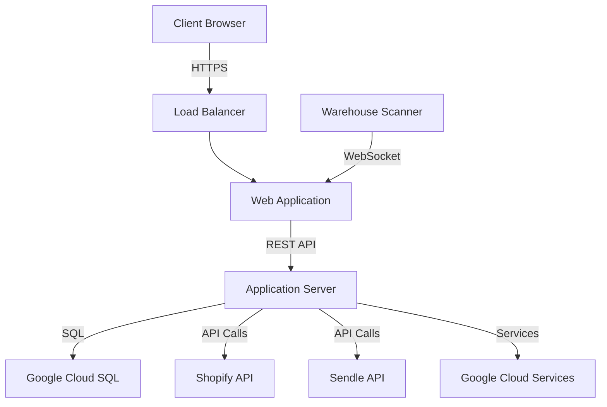

### 1.1.2 Key Components

1. **Frontend Application**
   - Technology: React with TypeScript
   - Styling: Tailwind CSS
   - Features: Responsive design, real-time updates, barcode scanning interface

2. **Backend Server**
   - Technology: Python (Flask or FastAPI)
   - Hosting: Google App Engine
   - Features: RESTful API, WebSocket support, background job processing

3. **Database**
   - Technology: Google Cloud SQL (PostgreSQL)
   - Features: High availability, automated backups, scalable performance

4. **External Integrations**
   - Shopify API: For order and product synchronization
   - Sendle API: For shipping label generation and tracking

5. **Cloud Services**
   - Google Cloud Storage: For storing generated reports and shipping labels
   - Google Cloud Pub/Sub: For handling asynchronous tasks and real-time updates
   - Google Cloud Identity Platform: For user authentication and management

### 1.1.3 Core Functionalities

| Functionality | Description |
|---------------|-------------|
| User Authentication | Secure login system with role-based access control |
| Order Management | Retrieval and processing of Shopify orders |
| Inventory Tracking | Real-time inventory management with barcode support |
| Fulfillment Process | Guided workflow for order picking and packing |
| Shipping Integration | Automated shipping label generation via Sendle |
| Reporting | Customizable reports for inventory and order analytics |

### 1.1.4 System Interactions

The Inventory Management and Fulfillment Application interacts with various external systems and user roles:

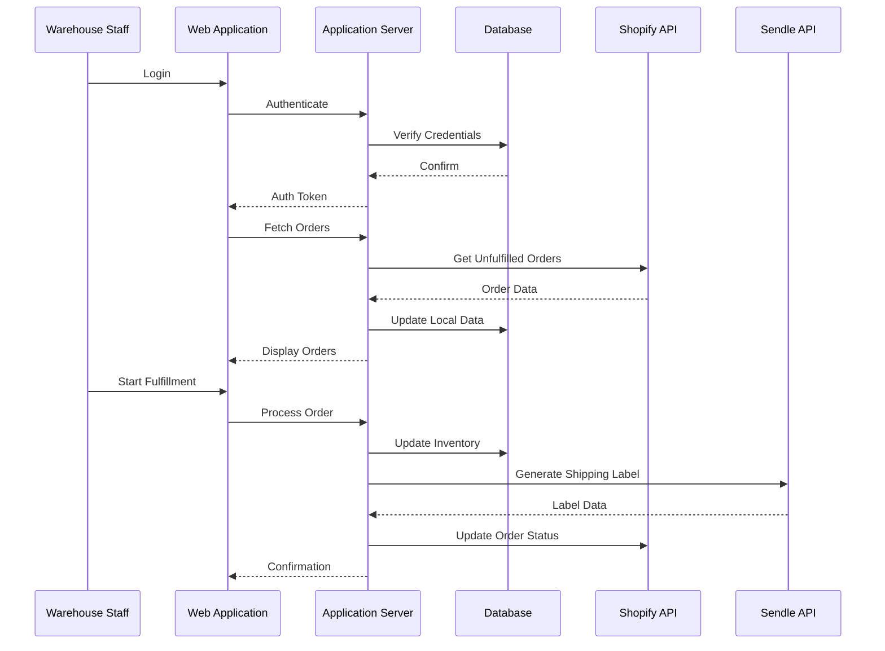

This system overview provides a high-level understanding of the Inventory Management and Fulfillment Application's architecture, components, and interactions. The use of TypeScript and React for the frontend, Python for the backend, and Google Cloud services for hosting and additional functionalities aligns with the specified technology preferences and ensures a modern, scalable, and maintainable solution.

# 5. SYSTEM ARCHITECTURE

## 5.1 PROGRAMMING LANGUAGES

The Inventory Management and Fulfillment Application will utilize the following programming languages:

| Language   | Purpose                                   | Justification                                                                                                   |
|------------|-------------------------------------------|----------------------------------------------------------------------------------------------------------------|
| TypeScript | Frontend development                      | Provides static typing for improved code quality and developer productivity in the React ecosystem              |
| Python     | Backend development                       | Offers excellent libraries for API development, data processing, and integration with Google Cloud services     |
| SQL        | Database queries and management           | Standard language for interacting with PostgreSQL database                                                      |
| HTML5      | Markup for web pages                      | Latest standard for structuring web content                                                                     |
| CSS3       | Styling web pages (via Tailwind CSS)      | Modern styling capabilities, with Tailwind providing utility-first approach for rapid UI development            |

## 5.2 HIGH-LEVEL ARCHITECTURE DIAGRAM

The following diagram provides an overview of the system's components and their interactions:

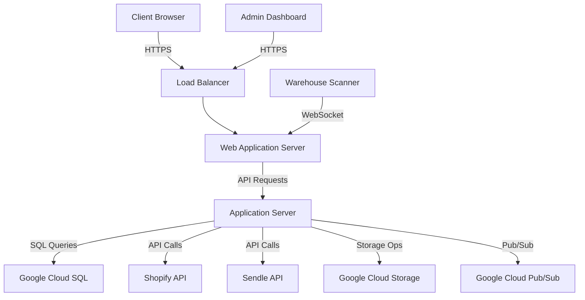

## 5.3 COMPONENT DIAGRAMS

### 5.3.1 Frontend Components

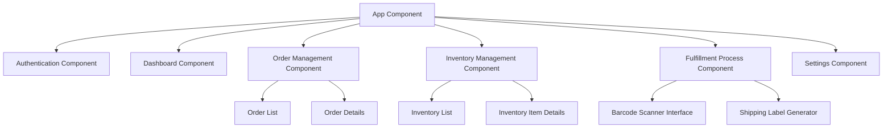

### 5.3.2 Backend Components

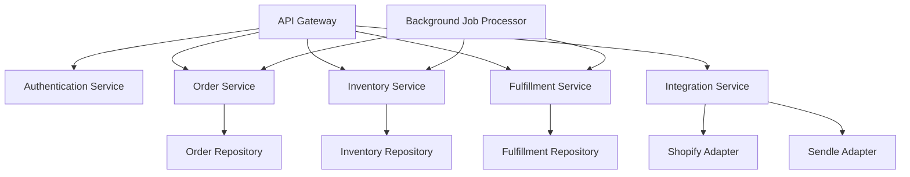

## 5.4 SEQUENCE DIAGRAMS

### 5.4.1 Order Fulfillment Process

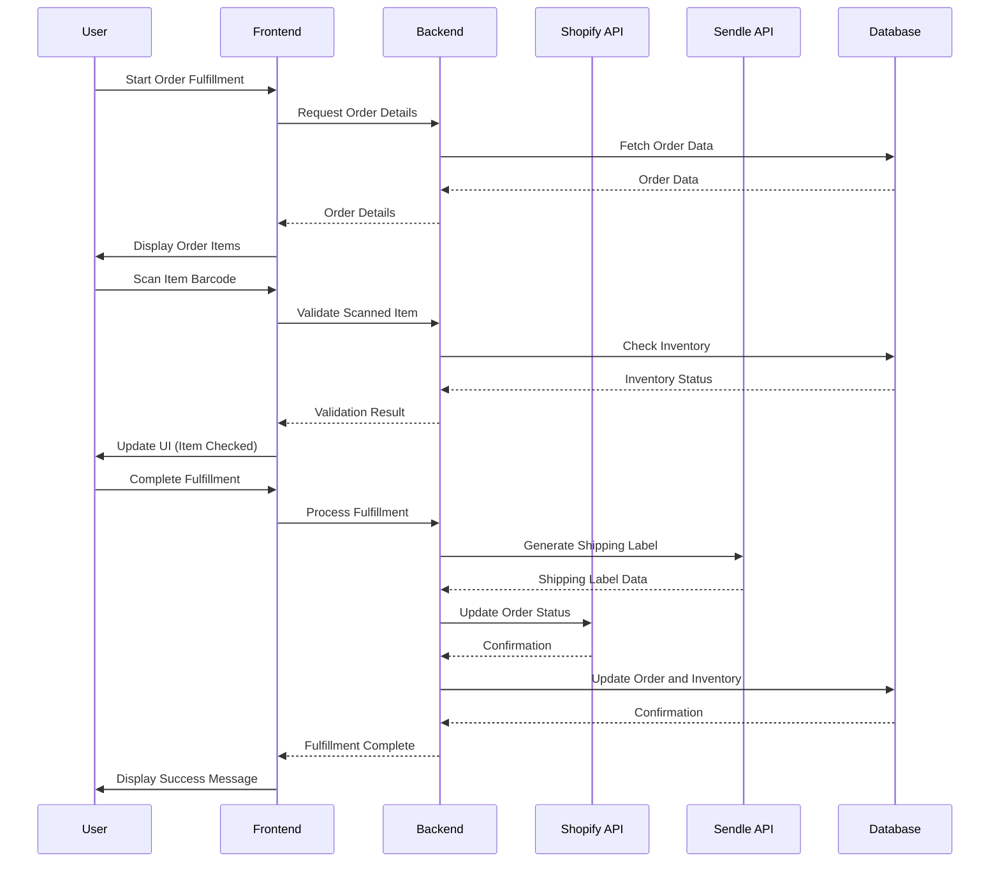

## 5.5 DATA-FLOW DIAGRAM

The following diagram illustrates how information moves through the Inventory Management and Fulfillment Application:

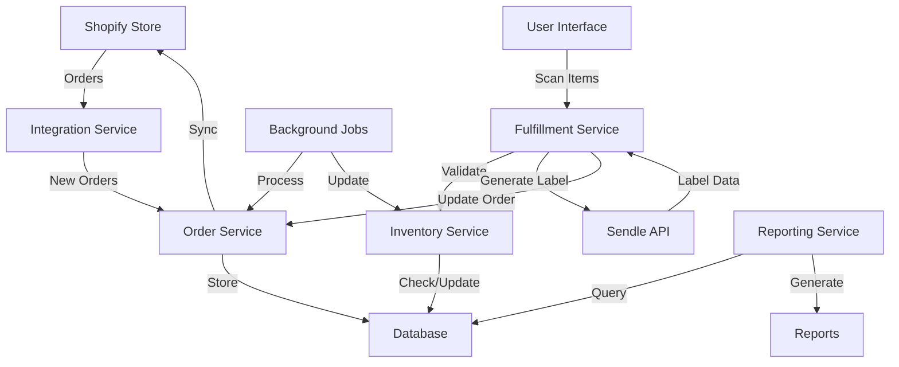

This data flow diagram demonstrates the movement of information from the Shopify store through various services of the application, including order processing, inventory management, fulfillment, and reporting. It shows how data is stored in the central database and how external APIs (Shopify and Sendle) are integrated into the workflow.

The architecture described in this section leverages TypeScript and React with Tailwind CSS for the frontend, Python for the backend services, and Google Cloud services (Cloud SQL, Cloud Storage, Cloud Pub/Sub) for infrastructure and additional functionalities. This design ensures a scalable, maintainable, and efficient system that meets the requirements of the Inventory Management and Fulfillment Application.

# 5. SYSTEM DESIGN

## 5.1 PROGRAMMING LANGUAGES

The Inventory Management and Fulfillment Application will utilize the following programming languages:

| Language   | Purpose                                   | Justification                                                                                                   |
|------------|-------------------------------------------|----------------------------------------------------------------------------------------------------------------|
| TypeScript | Frontend development                      | Provides static typing for improved code quality and developer productivity in the React ecosystem              |
| Python     | Backend development                       | Offers excellent libraries for API development, data processing, and integration with Google Cloud services     |
| SQL        | Database queries and management           | Standard language for interacting with PostgreSQL database                                                      |
| HTML5      | Markup for web pages                      | Latest standard for structuring web content                                                                     |
| CSS3       | Styling web pages (via Tailwind CSS)      | Modern styling capabilities, with Tailwind providing utility-first approach for rapid UI development            |

## 5.2 DATABASE DESIGN

The application will use Google Cloud SQL with PostgreSQL as the database management system. The database schema is designed to support the core functionalities of inventory management and order fulfillment:

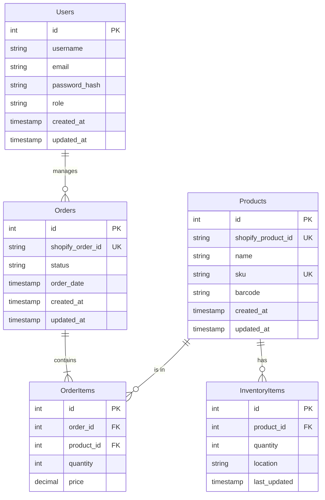

## 5.3 API DESIGN

The application will expose a RESTful API for communication between the frontend and backend, as well as for integration with external systems. The API will be designed using Python with Flask or FastAPI framework.

### 5.3.1 Core API Endpoints

| Endpoint                    | Method | Description                                      |
|-----------------------------|--------|--------------------------------------------------|
| `/api/auth/login`           | POST   | Authenticate user and return JWT                 |
| `/api/auth/logout`          | POST   | Invalidate user's JWT                            |
| `/api/orders`               | GET    | Retrieve list of orders                          |
| `/api/orders/<id>`          | GET    | Retrieve specific order details                  |
| `/api/orders/<id>/fulfill`  | POST   | Mark an order as fulfilled                       |
| `/api/inventory`            | GET    | Retrieve inventory list                          |
| `/api/inventory/<id>`       | PUT    | Update inventory item quantity                   |
| `/api/products`             | GET    | Retrieve product list                            |
| `/api/products/<id>`        | GET    | Retrieve specific product details                |
| `/api/shipping/label`       | POST   | Generate shipping label via Sendle API           |

### 5.3.2 Shopify Integration API

| Endpoint                    | Method | Description                                      |
|-----------------------------|--------|--------------------------------------------------|
| `/api/shopify/sync/orders`  | POST   | Sync orders from Shopify                         |
| `/api/shopify/sync/products`| POST   | Sync products from Shopify                       |
| `/api/shopify/webhook`      | POST   | Receive webhooks from Shopify                    |

### 5.3.3 API Authentication

The API will use JWT (JSON Web Tokens) for authentication. Each request to a protected endpoint must include a valid JWT in the Authorization header.

## 5.4 USER INTERFACE DESIGN

The user interface will be built using React with TypeScript and styled using Tailwind CSS. The design will focus on responsiveness and usability for desktop browsers.

### 5.4.1 Main Layout Components

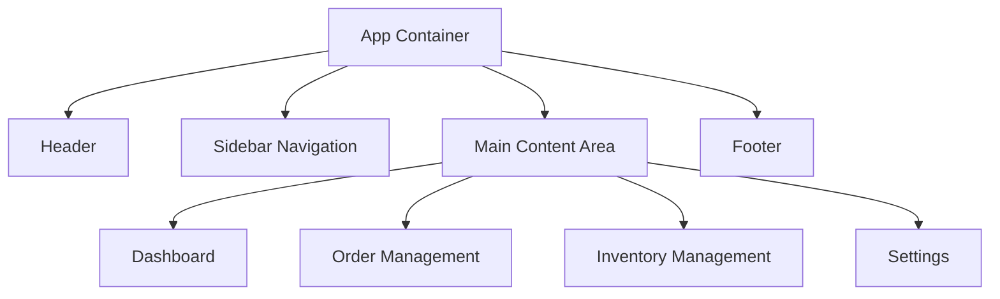

### 5.4.2 Key UI Components

1. Dashboard
   - Summary cards for key metrics (e.g., pending orders, low stock items)
   - Quick action buttons for common tasks
   - Recent activity feed

2. Order Management
   - Tabbed interface for different order statuses
   - Order list with sorting and filtering options
   - Order detail modal with fulfillment actions

3. Inventory Management
   - Data grid for inventory items with inline editing
   - Barcode scanner input for quick updates
   - Low stock alerts and reorder suggestions

4. Settings
   - Forms for API configuration (Shopify, Sendle)
   - User management interface for administrators

### 5.4.3 Responsive Design

The UI will be designed with a mobile-first approach using Tailwind CSS, ensuring that all components are usable on various screen sizes, with a focus on desktop usability as per the requirements.

### 5.4.4 Accessibility

The interface will be developed following WCAG 2.1 Level AA guidelines, ensuring that the application is accessible to users with disabilities. This includes:

- Proper heading structure
- ARIA labels for interactive elements
- Sufficient color contrast
- Keyboard navigation support

By adhering to these design principles and utilizing the specified technologies (TypeScript, React, Tailwind CSS for frontend; Python for backend; Google Cloud SQL for database), the Inventory Management and Fulfillment Application will provide a robust, scalable, and user-friendly solution for e-commerce businesses using Shopify.

# TECHNOLOGY STACK

## PROGRAMMING LANGUAGES

| Language   | Purpose                                   | Justification                                                                                                   |
|------------|-------------------------------------------|----------------------------------------------------------------------------------------------------------------|
| TypeScript | Frontend development                      | Provides static typing for improved code quality and developer productivity in the React ecosystem              |
| Python     | Backend development                       | Offers excellent libraries for API development, data processing, and integration with Google Cloud services     |
| SQL        | Database queries and management           | Standard language for interacting with PostgreSQL database                                                      |
| HTML5      | Markup for web pages                      | Latest standard for structuring web content                                                                     |
| CSS3       | Styling web pages (via Tailwind CSS)      | Modern styling capabilities, with Tailwind providing utility-first approach for rapid UI development            |

## FRAMEWORKS AND LIBRARIES

### Frontend

| Framework/Library | Purpose                                        | Justification                                                                    |
|-------------------|------------------------------------------------|-----------------------------------------------------------------------------------|
| React             | UI component library                           | Efficient rendering, component-based architecture, large ecosystem                |
| React Router      | Client-side routing                            | Seamless navigation in single-page applications                                   |
| Redux             | State management                               | Centralized state management for complex applications                             |
| Axios             | HTTP client                                    | Promise-based HTTP client for making API requests                                 |
| React Query       | Data fetching and caching                      | Simplifies data fetching, caching, and state management for API calls             |
| Tailwind CSS      | Utility-first CSS framework                    | Rapid UI development with pre-built utility classes                               |
| React Hook Form   | Form handling                                  | Efficient form management with minimal re-renders                                 |
| Zod               | Schema validation                              | TypeScript-first schema validation with static type inference                     |

### Backend

| Framework/Library | Purpose                                        | Justification                                                                    |
|-------------------|------------------------------------------------|-----------------------------------------------------------------------------------|
| FastAPI           | Web framework                                  | High-performance, easy-to-use framework for building APIs with Python            |
| SQLAlchemy        | ORM (Object-Relational Mapping)                | Powerful and flexible ORM for database interactions                               |
| Pydantic          | Data validation and settings management        | Seamless integration with FastAPI for request/response validation                 |
| Alembic           | Database migration tool                        | Version control for database schema changes                                       |
| Celery            | Distributed task queue                         | Asynchronous task processing for background jobs                                  |
| pytest            | Testing framework                              | Comprehensive testing suite for Python applications                               |

## DATABASES

| Database          | Purpose                                        | Justification                                                                    |
|-------------------|------------------------------------------------|-----------------------------------------------------------------------------------|
| PostgreSQL        | Primary relational database                    | Robust, scalable, and feature-rich database with excellent support for complex queries |
| Redis             | Caching and session storage                    | In-memory data structure store for high-performance caching and real-time data    |

## THIRD-PARTY SERVICES

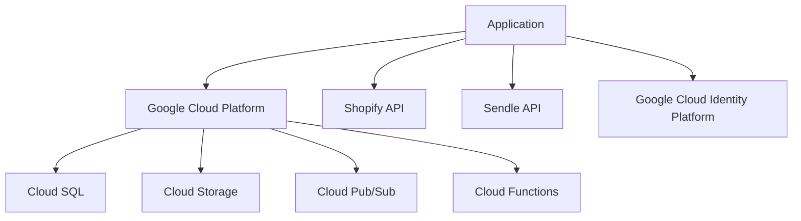

| Service                         | Purpose                                                            |
|---------------------------------|--------------------------------------------------------------------|
| Google Cloud SQL                | Managed PostgreSQL database service                                |
| Google Cloud Storage            | Object storage for files and backups                               |
| Google Cloud Pub/Sub            | Messaging service for event-driven architecture                    |
| Google Cloud Functions          | Serverless compute for specific tasks                              |
| Google Cloud Identity Platform  | User authentication and management                                 |
| Shopify API                     | Integration with e-commerce platform for order and product data    |
| Sendle API                      | Shipping label generation and tracking                             |
| Sentry                          | Error tracking and performance monitoring                          |
| Stripe                          | Payment processing (if required)                                   |

This technology stack leverages TypeScript and React with Tailwind CSS for the frontend, as requested. The backend uses Python with FastAPI, aligning with the preference for Python backends. The Google Cloud ecosystem is extensively used for various services, including database, storage, and authentication. This stack provides a robust, scalable, and maintainable foundation for the Inventory Management and Fulfillment Application, consistent with the requirements and preferences outlined in the document.

# SECURITY CONSIDERATIONS

## AUTHENTICATION AND AUTHORIZATION

The Inventory Management and Fulfillment Application will implement a robust authentication and authorization system to ensure secure access and appropriate permissions for users.

### Authentication

1. **Google Cloud Identity Platform Integration**
   - Leverage Google Cloud Identity Platform for user authentication
   - Implement OAuth 2.0 flow for secure token-based authentication

2. **Multi-Factor Authentication (MFA)**
   - Enable optional MFA for enhanced security
   - Support Time-based One-Time Password (TOTP) as a second factor

3. **Password Policies**
   - Enforce strong password requirements (minimum length, complexity)
   - Implement password hashing using bcrypt with a work factor of 12

4. **Session Management**
   - Use JWT (JSON Web Tokens) for maintaining user sessions
   - Implement token expiration and refresh mechanisms

### Authorization

1. **Role-Based Access Control (RBAC)**
   - Implement RBAC with the following roles:
     - Admin: Full system access
     - Manager: Access to reports and limited configuration
     - Warehouse Staff: Access to order fulfillment and inventory management

2. **Permission Matrix**

| Feature | Admin | Manager | Warehouse Staff |
|---------|-------|---------|-----------------|
| User Management | ✓ | - | - |
| System Configuration | ✓ | ✓ | - |
| Order Management | ✓ | ✓ | ✓ |
| Inventory Management | ✓ | ✓ | ✓ |
| Report Generation | ✓ | ✓ | - |
| API Integration Settings | ✓ | - | - |

3. **Frontend Authorization**
   - Implement route guards in React Router to prevent unauthorized access to protected routes
   - Use Higher-Order Components (HOCs) or custom hooks to wrap components that require specific permissions

4. **Backend Authorization**
   - Implement middleware in Python backend to validate JWT and check user permissions for each API endpoint

## DATA SECURITY

Protecting sensitive information is crucial for maintaining the integrity and confidentiality of the system.

1. **Encryption at Rest**
   - Utilize Google Cloud SQL's built-in encryption for database storage
   - Encrypt sensitive files stored in Google Cloud Storage using server-side encryption

2. **Encryption in Transit**
   - Enforce HTTPS for all client-server communications using TLS 1.3
   - Use SSL/TLS for database connections

3. **Data Masking**
   - Implement data masking for sensitive information in logs and non-production environments
   - Mask customer PII (Personally Identifiable Information) in user interfaces when full visibility is not required

4. **Secure API Communication**
   - Store API keys and secrets in Google Cloud Secret Manager
   - Implement API key rotation policies

5. **Data Retention and Deletion**
   - Implement data retention policies in compliance with relevant regulations (e.g., GDPR, CCPA)
   - Provide secure data deletion mechanisms for user data upon request

6. **Database Security**
   - Implement least privilege access for database users
   - Use parameterized queries to prevent SQL injection attacks

## SECURITY PROTOCOLS

The following security protocols will be implemented to maintain overall system security:

1. **Regular Security Audits**
   - Conduct quarterly security audits of the application and infrastructure
   - Perform annual penetration testing by a third-party security firm

2. **Vulnerability Management**
   - Implement a vulnerability scanning tool for continuous monitoring
   - Establish a process for timely patching of identified vulnerabilities

3. **Incident Response Plan**
   - Develop and maintain an incident response plan
   - Conduct annual incident response drills

4. **Secure Development Lifecycle**
   - Implement security checks in the CI/CD pipeline
   - Conduct code reviews with a focus on security best practices

5. **Access Control**
   - Implement the principle of least privilege for all system accesses
   - Use Multi-Factor Authentication (MFA) for administrative access to cloud resources

6. **Logging and Monitoring**
   - Implement centralized logging using Google Cloud Logging
   - Set up real-time alerts for suspicious activities

7. **Network Security**
   - Use Google Cloud VPC for network isolation
   - Implement Web Application Firewall (WAF) for protection against common web exploits

8. **API Security**
   - Implement rate limiting on API endpoints to prevent abuse
   - Use OAuth 2.0 for secure API authentication

9. **Security Training**
   - Conduct annual security awareness training for all employees
   - Provide role-specific security training for developers and operations staff

10. **Third-Party Security**
    - Conduct security assessments of third-party integrations (Shopify, Sendle)
    - Implement a vendor risk management process

11. **Data Flow Security**

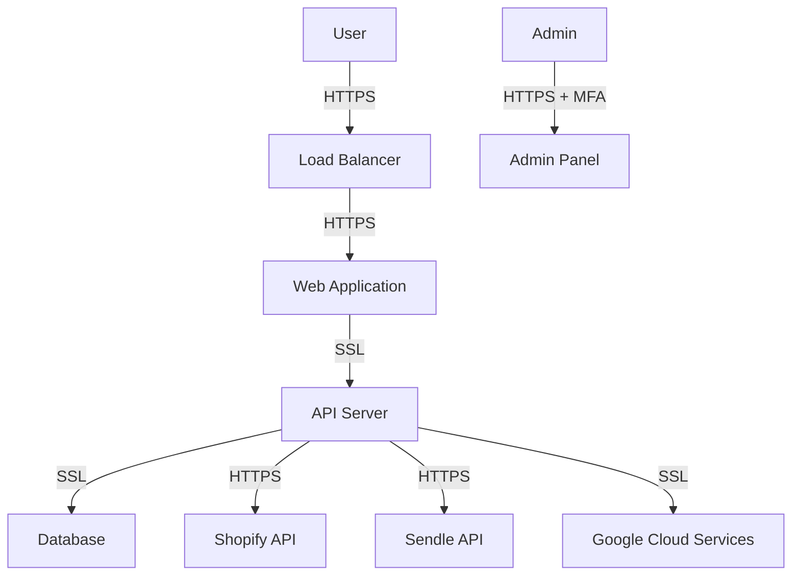

This security considerations section outlines a comprehensive approach to securing the Inventory Management and Fulfillment Application. It leverages Google Cloud services for enhanced security features while maintaining consistency with the previously specified technology stack (TypeScript, React, Tailwind CSS for frontend; Python for backend). The implementation of these security measures will help ensure the confidentiality, integrity, and availability of the system and its data.